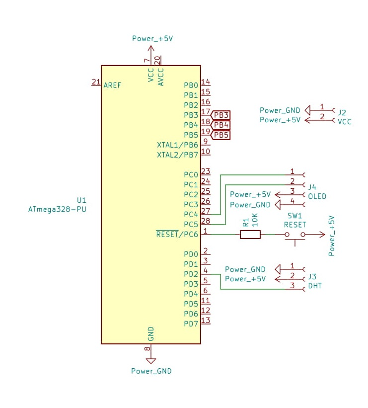
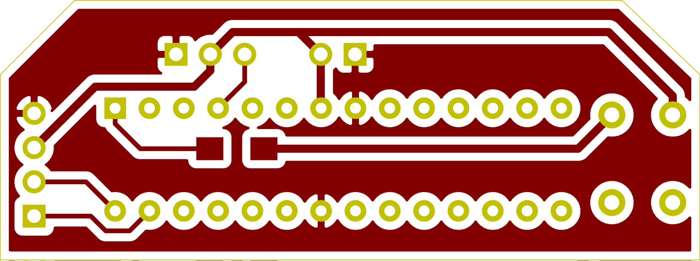

# Simple humidity indicator

This is a really simple board with code whose job is to show the temperature and relative humidity on a 128x32 OLED screen

(very important note: for the KiCAD project you need this symbol and footprint library https://gitlab.fabcloud.org/pub/libraries/electronics/kicad)

The board is actually really simple

I had to do this easy millable so this only uses big components with decent trace sizes and pads

## How it works

After you connect the OLED, DHT and power it up with voltages from 3.3V to 5.2V; It will show you the temperature and relative humidity of the surroundings on the screen, after that the MCU will go to sleep mode for 8 seconds approx(the internal 8MHz clock from the atmega328p is not really precise) and a watchdog will wake it up for the next refresh

## A few notes about the case

At board/case there are the files for 3d printing the case and the Fusion360 project in case someone wants to modify it.
If the case does not fit, print the bottom with 102% XY size and the lid with 101.5% XY size
